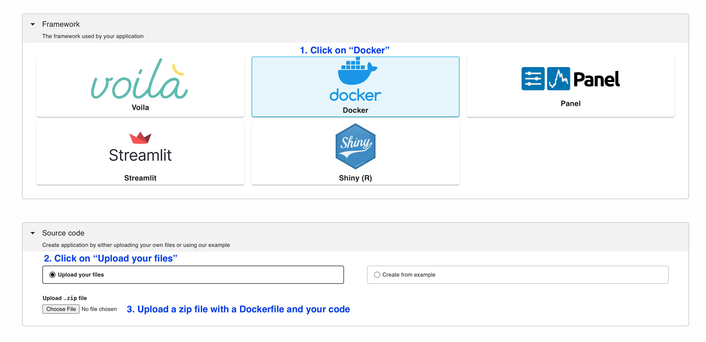

# FastAPI

To deploy a FastAPI application in Ploomber Cloud you need:

- A `Dockerfile`
- Your code

## `Dockerfile`

You need to provide a `Dockerfile`, you can use this [template](https://github.com/ploomber/doc/blob/main/examples/docker/fastapi/Dockerfile) to get started. The template contains the minimal steps needed for a deployment but you need to modify so it installs any required dependencies and copies your code into the Docker image.

```Dockerfile
FROM python:3.11

# assumes app.py contains your fastapi app
COPY app.py app.py
# install dependencies
RUN pip install fastapi uvicorn

# this configuration is needed for your app to work, do not change it
ENTRYPOINT ["uvicorn", "app:app", "--host=0.0.0.0", "--port=80"]
```


## Testing locally

To test your app, you can use `docker` locally:

```sh
# build the docker image
docker build . -t fastapi

# run it
docker run -p 5000:80 fastapi
```

Now, open [http://0.0.0.0:5000/](http://0.0.0.0:5000/) to see your app.


## Deploy

Once you have all your files, create a zip file.

To deploy a Flask app from the deployment menu, follow these instructions:

