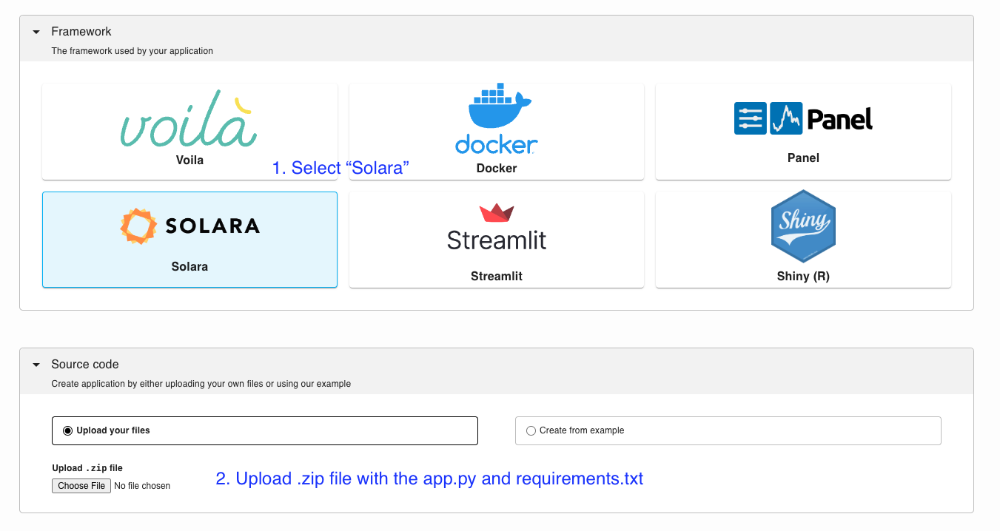

# Solara

Ploomber Cloud supports [Solara](https://solara.dev/). For information on how to develop Solara apps, [please check the documentation](https://solara.dev/docs).

To deploy a Solara app you need at least two files zipped up:

1. Your application file (`app.py`)
2. A dependencies file (`requirements.txt`)

```{note}
We currently only support Solara deployments via a `app.py` file, not via `.ipynb` files
```

## Dependencies

To deploy a new project, list your dependencies in a (`requirements.txt`). For example, if you're using [JupySQL](https://jupysql.ploomber.io), pandas and matplotlib in the solara application, your `requirements.txt` file will look like this:

```
# sample requirements.txt
solara
jupysql
pandas
matplotlib
```


## Deploy

Once you have all your files, create a zip file.

To deploy a Solara app from the deployment menu, follow these instructions:



## Example
Ploomber has created an example solara app for your convenience.

Check it out [here.](https://github.com/ploomber/doc/blob/main/examples/solara/gpt-4-tokenizer/app.py)
