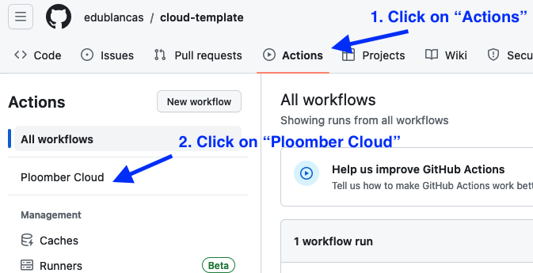
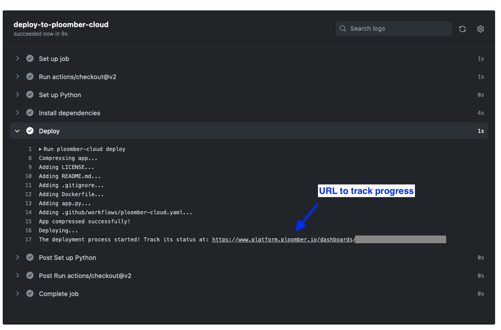

# GitHub deployment

You can use GitHub Actions to deploy your project on each push.

First, you need to get your [API key](../quickstart/apikey.md). Once you have the API
key, you need to store it as a GitHub secret in your repository:


Then, install the CLI:

```sh
# install package
pip install ploomber-cloud
```

And set the API key locally:

```sh
ploomber-cloud key YOURKEY
```

Now, configure your project:

```sh
ploomber-cloud init
```

`init` will create a `ploomber-cloud.json` file. For more information on the `init` command, see [](../user-guide/cli.md)

Now, configure GitHub actions by adding [this YAML file](https://github.com/edublancas/cloud-template/blob/main/.github/workflows/ploomber-cloud.yaml) in `.github/workflows/ploomber-cloud.yaml`

Finally, commit and push the new files:

```sh
# commit ploomber cloud and github actions config files
git add ploomber-cloud.json .github/workflows/ploomber-cloud.yaml
git commit -m 'configure github actions deployment'
git push
```

Once you push, you can monitor progress from GitHub. First, go to the actions section:



Then, click on the most recent run, and you'll see the logs:



In the logs, you'll see a URL that you can use to track progress.

A complete sample project is [available here.](https://github.com/edublancas/cloud-template)