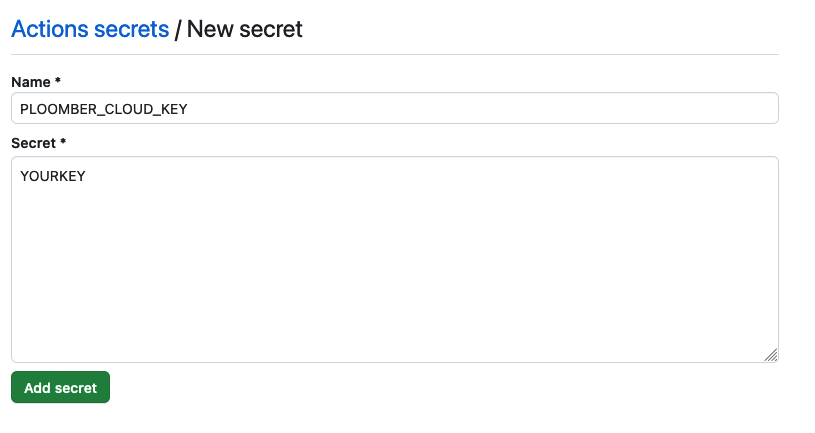

# GitHub deployment

You can use GitHub Actions to deploy your project on each push.

First, you need to get your [API key](../quickstart/apikey.md). Once you have the API
key, you need to store it as a GitHub secret in your repository:





Then, install the CLI:

```sh
# install package
pip install ploomber-cloud
```

And set the API key locally:

```sh
ploomber-cloud key YOURKEY
```

Now, configure your project:

```sh
ploomber-cloud init
```

`init` will create a `ploomber-cloud.json` file. For more information on the `init` command, see [](../user-guide/cli.md)

Now, configure GitHub actions by adding [this YAML file](https://github.com/edublancas/cloud-template/blob/main/.github/workflows/ploomber-cloud.yaml) in `.github/workflows/ploomber-cloud.yaml`

Finally, commit and push the new files:

```sh
# commit ploomber cloud and github actions config files
git add ploomber-cloud.json .github/workflows/ploomber-cloud.yaml
git commit -m 'configure github actions deployment'
git push
```

Once you push, you can monitor progress from GitHub. First, go to the actions section:


Then, click on the most recent run, and you'll see the logs:


In the logs, you will see updates on the progress of the deployment. You'll also see a URL to your project dashboard, which also shows its progress.

If you would prefer to track progress only through the project dashboard, you can remove `--watch` from the `deploy` command in your `ploomber-cloud.yaml`:

```
 - name: Deploy
        env:
          PLOOMBER_CLOUD_KEY: ${{ secrets.PLOOMBER_CLOUD_KEY }}
        run: |
          ploomber-cloud deploy # remove '--watch' here
```

Removing `--watch` means deployment updates won't be output to the logs, but you will still be able to track its progress through the URL.

A complete sample project is [available here.](https://github.com/edublancas/cloud-template)